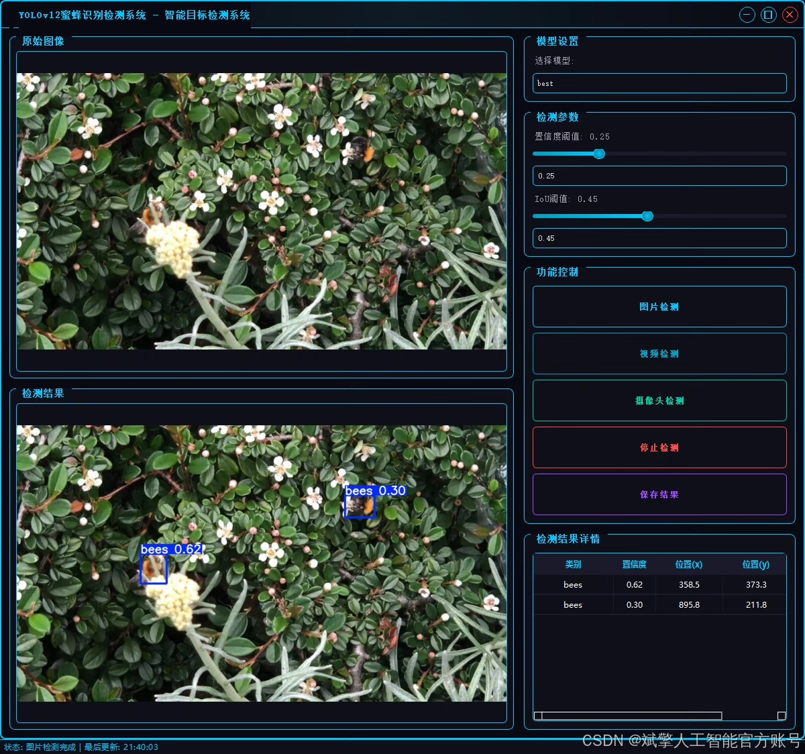
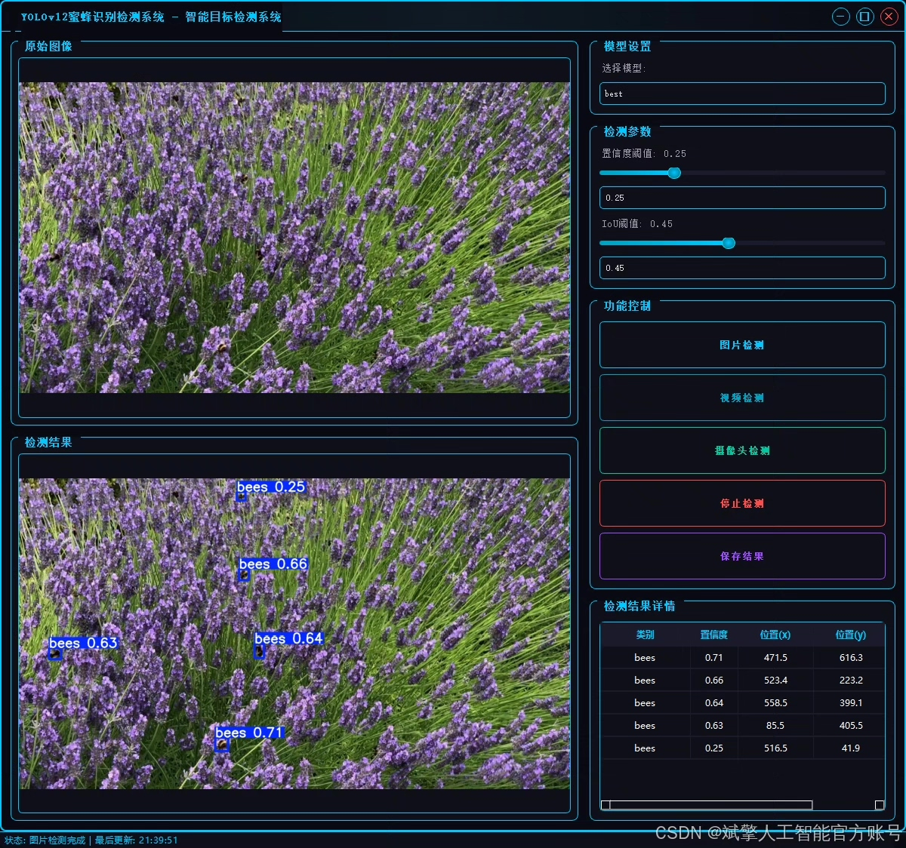
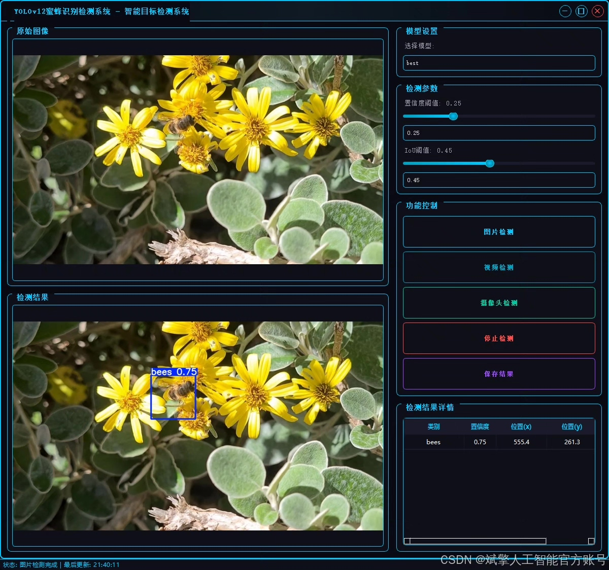
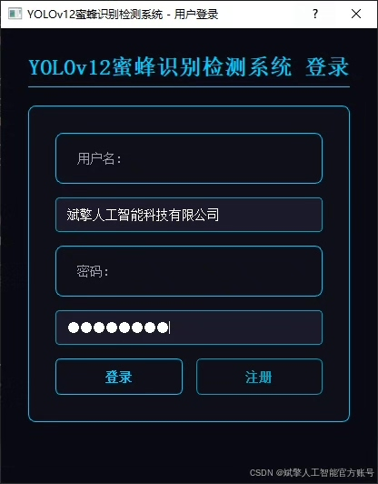
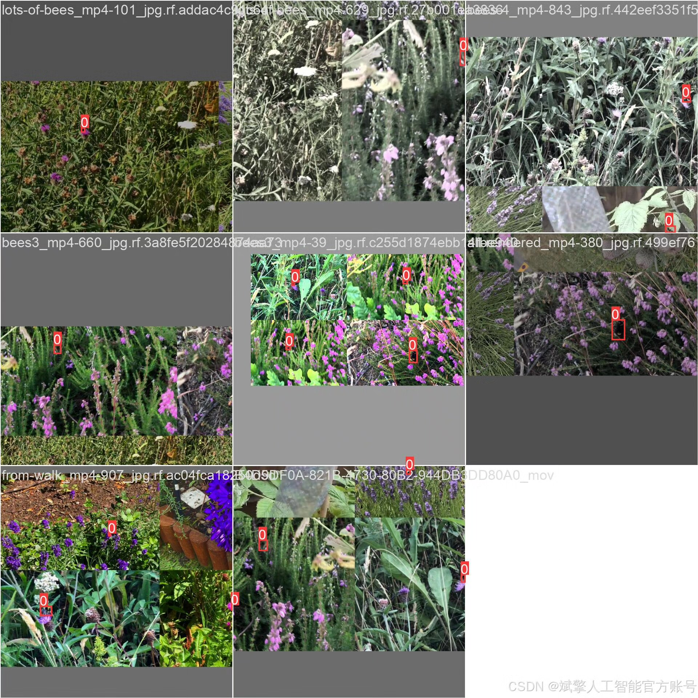
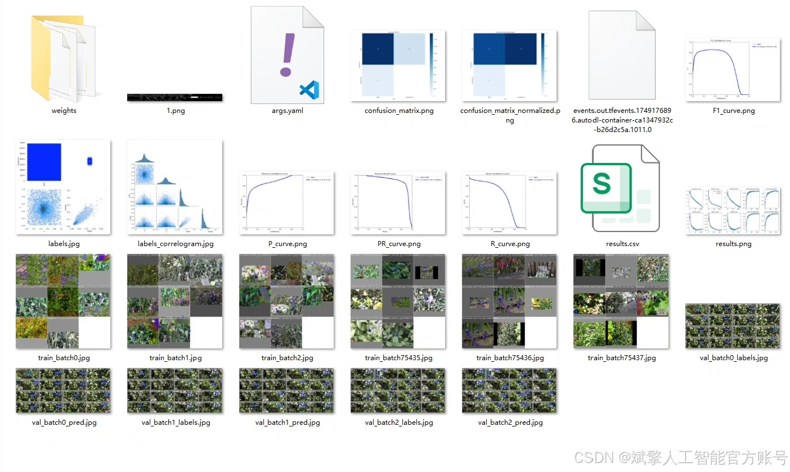
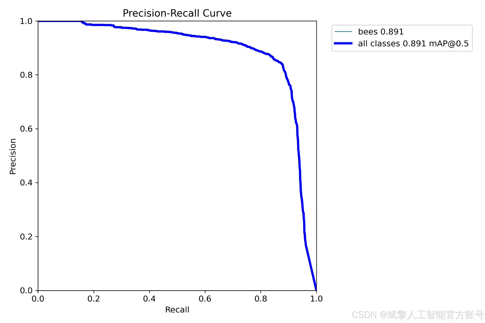
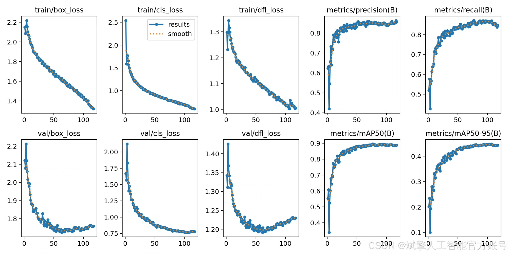
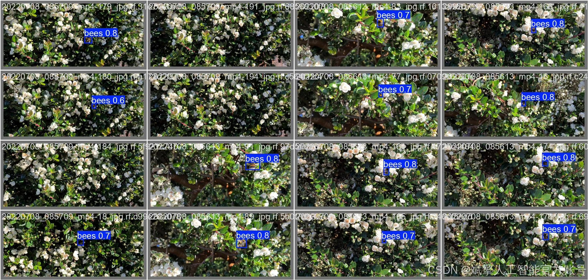

# YOLOv12 Bee Detection System

## Body

The YOLOv12 Bee Identification System is based on deep learning YOLOv12, featuring a bee identification and detection system (YOLOv12+YOLO dataset + UI interface + login registration interface + Python project source code + model).

This paper designs and implements a bee automatic recognition and detection system based on the deep learning target detection algorithm YOLOv12. The system aims to address issues of low efficiency and subjectivity in manual observation for agricultural monitoring, ecological research, and bee colony health management. The project is based on an in-house dataset containing 8080 high-quality bee annotated images, divided into training set (5640), validation set (1604), and test set (836) at a ratio of approximately 7:2:1, ensuring the effectiveness of model training and reliability of evaluation.

We use the latest YOLOv12 model for training, which has significantly improved accuracy and speed compared to previous generations of YOLO series, allowing for rapid and accurate identification of bee individuals from complex natural backgrounds. The final trained model achieved an average precision (mAP) of 89.1% on the test set, demonstrating excellent performance. Additionally, this project developed a complete user interface (UI), integrating user login registration, image/video upload, real-time detection, greatly enhancing the system's ease of use and practicality. This system provides an efficient and reliable end-to-end solution for automated monitoring of bee colonies, with good application prospects and value for promotion.

✅ User login registration: Supports password verification and security validation.
✅ Three detection modes: Based on the YOLOv12 model, supports image, video, and real-time camera detection, accurately identifying targets.
✅ Dual-screen comparison: Displays original images and detection results simultaneously on the screen.
✅ Data visualization: Real-time table displaying the category, confidence, and coordinates of detected targets.
✅ Intelligent parameter adjustment: Offers a confidence slide bar for dynamic optimization of detection accuracy, adapting to different scene requirements.
✅ Sci-fi style interactive interface: Dark theme combined with dynamic light effects, reducing visual fatigue and improving operational experience.

## Images

## Payment

Here is a pay link on Stripe ( https://buy.stripe.com/3cs8yP7sY87d0vu9AB ). Please contact me lonlonago@foxmail.com after funding $89, and I will send you a complete data files , thank you!

